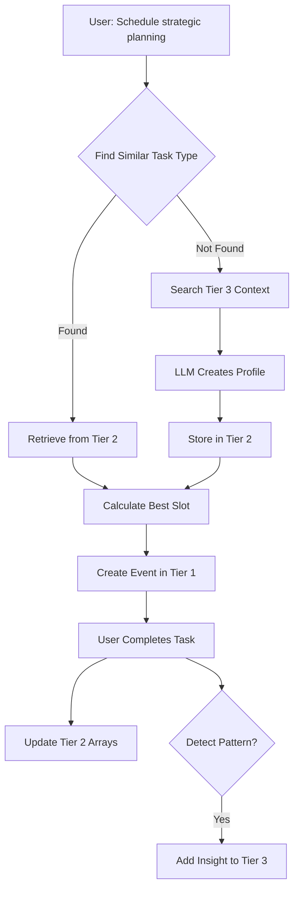

# Smart Scheduler System: Comprehensive Architecture Guide

## Table of Contents

1. [Executive Summary](#executive-summary)
2. [System Philosophy](#system-philosophy)
3. [Three-Tier Architecture](#three-tier-architecture)
4. [Tier 1: Events Layer](#tier-1-events-layer)
5. [Tier 2: Task Types Layer](#tier-2-task-types-layer)
6. [Tier 3: Memory Graph Layer](#tier-3-memory-graph-layer)
7. [Inter-Tier Communication](#inter-tier-communication)
8. [Learning Mechanisms](#learning-mechanisms)
9. [Multi-User Architecture](#multi-user-architecture)
10. [Implementation Details](#implementation-details)
11. [Performance & Scaling](#performance-scaling)
12. [Future Enhancements](#future-enhancements)

---

## Executive Summary

The Smart Scheduler System is a behavior-driven, AI-powered scheduling platform that learns from user actions rather than explicit preferences. It employs a sophisticated three-tier architecture that separates event instances, reusable patterns, and contextual insights, enabling efficient scheduling decisions with minimal LLM usage.

### Key Innovations:
- **95% LLM-Free Operations**: After initial learning, most scheduling uses pre-computed arrays
- **Behavior-Driven Learning**: No questionnaires - learns from actual usage patterns
- **Three-Tier Separation**: Clean architecture separating instances, patterns, and insights
- **Progressive Enhancement**: System improves with every interaction
- **Multi-User Scalability**: Supports thousands of users with complete data isolation

---

## System Philosophy

### Core Problem
Traditional schedulers treat all "meetings" identically, ignoring that a "morning standup" and "investor pitch" have vastly different cognitive demands, optimal timing, and recovery needs.

### Our Solution
1. **Learn Once, Apply Many**: First occurrence uses LLM to understand; subsequent uses leverage vector similarity
2. **Behavior Over Preferences**: Learn from what users do, not what they say
3. **Intelligent Caching**: Store patterns as reusable arrays for instant decisions

### Design Principles
- **Minimal Onboarding**: 30 seconds to start (just pick role + 3 starter tasks)
- **No Self-Categorization**: Never ask "are you a morning person?"
- **Continuous Learning**: Every completed task refines predictions
- **Privacy by Design**: Complete user isolation in multi-tenant environment

---

## Three-Tier Architecture

The system's power comes from cleanly separating three distinct types of information:

```
┌─────────────────────────────────────────────────────────────┐
│                    TIER 3: MEMORY GRAPH                      │
│  Qualitative insights, contextual knowledge, relationships   │
│  "User struggles with deep work after lunch meetings"        │
│  Stored in: Mem0 (Vector embeddings for semantic search)    │
└─────────────────────────────────────────────────────────────┘
                              ↕
┌─────────────────────────────────────────────────────────────┐
│                  TIER 2: TASK TYPES                          │
│  Reusable patterns, learned arrays, quantitative data        │
│  "team meeting": [0.2, 0.3, ..., 0.9, 0.8, ..., 0.1]       │
│  Stored in: Supabase (Structured tables with JSONB arrays)  │
└─────────────────────────────────────────────────────────────┘
                              ↕
┌─────────────────────────────────────────────────────────────┐
│                    TIER 1: EVENTS                            │
│  Individual instances, actual scheduled items                │
│  "Team standup on Dec 15 at 9:00 AM"                       │
│  Stored in: Supabase (Lightweight relational records)       │
└─────────────────────────────────────────────────────────────┘
```

### Why This Separation Matters

1. **Performance**: Events stay lightweight; patterns are pre-computed; insights provide context only when needed
2. **Learning**: Each tier learns at different rates - events are instant, patterns evolve gradually, insights emerge over time
3. **Flexibility**: Can query each tier independently based on needs
4. **Scalability**: Most operations only touch Tiers 1-2; Tier 3 accessed only for new task types

---

## Tier 1: Events Layer

### Purpose
Store individual scheduled instances without duplicating pattern data.

### Schema
```sql
CREATE TABLE events (
    id UUID PRIMARY KEY,
    user_id TEXT NOT NULL,
    task_type_id UUID REFERENCES task_types(id),
    
    -- Instance data only
    title TEXT NOT NULL,
    scheduled_start TIMESTAMP,
    scheduled_end TIMESTAMP,
    
    -- Completion tracking
    completed BOOLEAN DEFAULT FALSE,
    success_rating FLOAT,
    energy_after FLOAT,
    
    -- Minimal metadata
    created_at TIMESTAMP DEFAULT NOW()
);
```

### Key Characteristics
- **Lightweight**: ~200 bytes per record
- **No Arrays**: All patterns stored in Tier 2
- **Fast Queries**: Indexed on (user_id, scheduled_start)
- **Immutable Data**: Past events never change

### Example Event
```json
{
  "id": "evt_123",
  "user_id": "user_456",
  "task_type_id": "tt_789",
  "title": "Q4 Planning Meeting",
  "scheduled_start": "2024-12-15T09:00:00Z",
  "scheduled_end": "2024-12-15T10:30:00Z",
  "completed": true,
  "success_rating": 0.9,
  "energy_after": 0.7
}
```

---

## Tier 2: Task Types Layer

### Purpose
Store reusable patterns learned from user behavior - the "intelligence" layer.

### Schema
```sql
CREATE TABLE task_types (
    id UUID PRIMARY KEY,
    user_id TEXT NOT NULL,
    
    -- Identity
    task_type TEXT NOT NULL,
    category TEXT CHECK (category IN ('focused', 'collaborative', 'administrative')),
    
    -- Learned patterns (24-hour arrays)
    hourly_scores JSONB,        -- [0.1, 0.2, ..., 0.9, 0.8, ..., 0.1]
    confidence_scores JSONB,    -- [0.3, 0.4, ..., 0.9, 0.9, ..., 0.5]
    performance_by_hour JSONB,  -- [0.5, 0.6, ..., 0.8, 0.9, ..., 0.4]
    
    -- Energy patterns
    cognitive_load FLOAT,       -- 0.8 (high demand)
    recovery_hours FLOAT,       -- 1.5 (needs 90min recovery)
    depletion_curve JSONB,      -- [1.0, 0.8, 0.6, 0.4, 0.2]
    
    -- Vector for similarity
    embedding vector(1536),
    
    UNIQUE(user_id, task_type)
);
```

### Learned Arrays Explained

Each task type maintains several 24-element arrays representing hourly patterns:

#### Hourly Scores Array
```python
hourly_scores = [
    0.05,  # 00:00 - Midnight (low preference)
    0.03,  # 01:00
    0.02,  # 02:00
    0.02,  # 03:00
    0.02,  # 04:00
    0.03,  # 05:00
    0.10,  # 06:00 - Early morning
    0.25,  # 07:00
    0.45,  # 08:00
    0.85,  # 09:00 - Peak hours for this task
    0.90,  # 10:00 - Highest preference
    0.88,  # 11:00
    0.60,  # 12:00 - Lunch dip
    0.40,  # 13:00
    0.65,  # 14:00 - Afternoon recovery
    0.70,  # 15:00
    0.55,  # 16:00
    0.35,  # 17:00
    0.25,  # 18:00 - Evening decline
    0.20,  # 19:00
    0.15,  # 20:00
    0.10,  # 21:00
    0.08,  # 22:00
    0.05   # 23:00
]
```

#### How Arrays Are Updated
```python
def update_hourly_pattern(hour, success, current_score, confidence):
    # Adaptive learning rate based on confidence
    learning_rate = 0.3 * (1 - confidence)
    
    # Success reinforces, failure reduces
    signal = 0.9 if success else 0.1
    
    # Weighted update
    new_score = current_score * (1 - learning_rate) + signal * learning_rate
    
    # Increase confidence
    new_confidence = min(0.95, confidence + 0.05)
    
    return new_score, new_confidence
```

### Task Type Categories

Only 3 categories cover all use cases:
1. **Focused**: Deep work, study, planning, coding
2. **Collaborative**: Meetings, calls, discussions
3. **Administrative**: Email, quick tasks, routine work

### Vector Embeddings

Each task type has a 1536-dimensional embedding for similarity search:
```python
# "Quarterly financial planning" → [0.012, -0.456, 0.789, ...]
# "Annual budget review" → [0.015, -0.448, 0.801, ...]
# Cosine similarity: 0.94 (very similar, reuse patterns!)
```

---

## Tier 3: Memory Graph Layer

### Purpose
Store qualitative insights, contextual relationships, and emergent patterns.

### Storage: Mem0
Unlike Tiers 1-2 which use structured Supabase tables, Tier 3 uses Mem0's graph-based memory system.

### What Goes in Tier 3

#### ✅ Qualitative Insights
```python
mem0.add(
    "User experiences energy crashes after back-to-back meetings",
    user_id="user_123"
)

mem0.add(
    "Best creative work happens in quiet morning hours before emails",
    user_id="user_123"
)
```

#### ✅ Contextual Relationships
```python
mem0.add(
    "Project X meetings are high-stress and need recovery time",
    user_id="user_123"
)

mem0.add(
    "Prefers clustering all calls on Tuesdays and Thursdays",
    user_id="user_123"
)
```

#### ✅ Emergent Patterns
```python
mem0.add(
    "Productivity drops significantly after 3 consecutive meetings",
    user_id="user_123"
)
```

#### ❌ What Does NOT Go in Tier 3
- Quantitative data: "Best time for meetings: 10 AM" → Goes in Tier 2 arrays
- Structured patterns: "Cognitive load: 0.8" → Goes in Tier 2 fields
- Individual events: "Meeting at 3 PM tomorrow" → Goes in Tier 1

### How Tier 3 Is Used

1. **New Task Type Creation**: When encountering "Executive strategy session" for the first time:
```python
# Search Mem0 for context
insights = mem0.search(
    "executive strategy planning user preferences energy",
    user_id=user_id
)

# Returns:
# - "User finds strategic thinking best in early morning"
# - "Needs quiet environment for planning work"
# - "Executive meetings often run longer than scheduled"

# LLM uses these insights to initialize patterns intelligently
```

2. **Pattern Detection**: System notices trends and records them:
```python
if friday_success_rate < 0.5 * average_success_rate:
    mem0.add(
        "User shows consistently lower performance on Fridays, "
        "possibly due to fatigue accumulation",
        user_id=user_id
    )
```

---

## Inter-Tier Communication

### Scheduling Flow



### Data Flow Examples

#### Example 1: Scheduling Known Task Type
```python
# User wants to schedule "Team standup"
# 1. Vector search in Tier 2 finds existing "Daily team sync"
# 2. Retrieve arrays: peak at 9-10 AM, 30min duration
# 3. Check Tier 1 for conflicts
# 4. Create event in Tier 1
# Total time: ~50ms, No LLM needed
```

#### Example 2: New Task Type
```python
# User wants to schedule "Board presentation"
# 1. Vector search in Tier 2 finds no match > 0.8 similarity
# 2. Search Tier 3: "high-stakes presentations drain energy"
# 3. Find similar in Tier 2: "Stakeholder meeting" (0.65 similarity)
# 4. LLM combines context to create profile
# 5. Store new type in Tier 2
# 6. Create event in Tier 1
# Total time: ~2s, One LLM call
```

#### Example 3: Learning from Completion
```python
# User completes "Deep coding session" at 2 PM, success=False
# 1. Update Tier 2 arrays: reduce 2 PM preference
# 2. Check pattern: 3rd failed afternoon coding
# 3. Add to Tier 3: "User struggles with complex tasks post-lunch"
# 4. Future scheduling avoids afternoon for high-cognitive tasks
```

---

## Learning Mechanisms

### 1. Array-Based Learning (Tier 2)

Every task completion updates multiple arrays:

```python
def learn_from_completion(event, success, energy_after):
    task_type = get_task_type(event.task_type_id)
    hour = event.start_time.hour
    
    # Update task-specific pattern
    task_type.hourly_scores[hour] = update_with_confidence(
        current=task_type.hourly_scores[hour],
        signal=0.9 if success else 0.1,
        confidence=task_type.confidence_scores[hour]
    )
    
    # Update user's general patterns
    user_patterns.energy_pattern[hour] = update_with_confidence(
        current=user_patterns.energy_pattern[hour],
        signal=energy_after,
        confidence=user_patterns.energy_confidence[hour]
    )
    
    # Detect if this is a pattern
    if afternoon_failures > 3:
        add_insight_to_tier3("Afternoon cognitive performance issues detected")
```

### 2. Pattern Emergence (Tier 3)

System detects and records insights without explicit programming:

```python
# Automatic "morning person" detection
morning_energy = mean(energy_pattern[6:12])  # 6 AM - 12 PM
evening_energy = mean(energy_pattern[18:23]) # 6 PM - 11 PM

if confidence > 0.7 and morning_energy > evening_energy * 1.3:
    mem0.add("User shows strong morning energy patterns", user_id)
```

### 3. Confidence-Weighted Updates

Learning rate decreases as confidence increases:
```python
learning_rate = base_rate * (1 - confidence)
# New patterns: LR = 0.3 * (1 - 0.1) = 0.27 (learns quickly)
# Established: LR = 0.3 * (1 - 0.9) = 0.03 (resists change)
```

---

## Multi-User Architecture

### User Isolation

Each tier maintains complete user separation:

#### Tier 1 (Events)
```sql
-- Row Level Security
ALTER TABLE events ENABLE ROW LEVEL SECURITY;
CREATE POLICY "Users see own events" ON events
    FOR ALL USING (auth.uid() = user_id);
```

#### Tier 2 (Task Types)
```sql
-- User-scoped vector search
CREATE FUNCTION match_user_task_types(
    query_embedding vector(1536),
    p_user_id text
) RETURNS TABLE (...) AS $$
BEGIN
    RETURN QUERY
    SELECT * FROM task_types
    WHERE user_id = p_user_id  -- User isolation
    ORDER BY embedding <=> query_embedding;
END;
$$;
```

#### Tier 3 (Memory Graph)
```python
# Mem0 handles isolation natively
mem0.add("insight", user_id="user_123")
mem0.search("query", user_id="user_123")  # Only returns user's memories
```

### Scaling Considerations

- **Tier 1**: Millions of events, partitioned by user_id and date
- **Tier 2**: Thousands of task types per user, vector indexes for fast similarity
- **Tier 3**: Mem0 handles scaling, memories are sparse and queryable

---

## Implementation Details

### Core Scheduler Class

```python
class BehaviorDrivenScheduler:
    def __init__(self, user_id: str):
        self.user_id = user_id
        self.supabase = create_client(...)
        self.mem0 = mem0.Memory()
        
        # Load Tier 2 data
        self.task_types = self._load_user_task_types()
        self.user_patterns = self._load_user_patterns()
    
    async def schedule_event(self, description: str, duration: float = None):
        # 1. Search Tier 2 for similar task type
        task_type = await self._find_or_create_task_type(description)
        
        # 2. Use arrays to find optimal time
        best_slot = self._calculate_optimal_slot(
            task_type=task_type,
            duration=duration or task_type['typical_duration']
        )
        
        # 3. Create in Tier 1
        event = self._create_event(task_type, best_slot)
        
        return event
    
    async def _find_or_create_task_type(self, description: str):
        # Vector search in Tier 2
        embedding = generate_embedding(description)
        similar = self.supabase.rpc('match_user_task_types', {
            'query_embedding': embedding,
            'p_user_id': self.user_id
        }).execute()
        
        if similar.data and similar.data[0]['similarity'] > 0.8:
            return similar.data[0]
        
        # Not found - check Tier 3 for context
        context = self.mem0.search(
            f"preferences for {description}",
            user_id=self.user_id
        )
        
        # Create new type with LLM
        return await self._create_task_type_with_context(
            description, embedding, context
        )
```

### Minimal Onboarding

```python
# Just 3 starter tasks based on role
def get_starter_tasks(role):
    if role == 'student':
        return [
            {'name': 'Study session', 'category': 'focused'},
            {'name': 'Class attendance', 'category': 'collaborative'},
            {'name': 'Assignment work', 'category': 'focused'}
        ]
    elif role == 'pm':
        return [
            {'name': 'Team meeting', 'category': 'collaborative'},
            {'name': 'Planning work', 'category': 'focused'},
            {'name': 'Stakeholder sync', 'category': 'collaborative'}
        ]
```

---

## Performance & Scaling

### Query Performance

| Operation | Tiers Used | Time | LLM Calls |
|-----------|------------|------|-----------|
| Schedule known task | 1, 2 | ~50ms | 0 |
| Schedule new task | 1, 2, 3 | ~2s | 1 |
| Complete task | 1, 2 | ~100ms | 0 |
| Detect pattern | 2, 3 | ~200ms | 0 |
| Get insights | 2, 3 | ~150ms | 0 |

### Cost Analysis

Traditional LLM-based scheduler:
- Every schedule request: 1 LLM call (~$0.02)
- 20 tasks/day = $0.40/day = $146/year per user

Our Three-Tier System:
- Week 1: ~20% need LLM = $0.08/day
- Week 2: ~5% need LLM = $0.02/day
- Steady state: <1% need LLM = $0.004/day = $1.46/year per user

**100x cost reduction** while providing better personalization!

### Storage Requirements

Per user:
- Tier 1 (Events): ~50KB/year (250 events × 200 bytes)
- Tier 2 (Task Types): ~20KB (20 types × 1KB arrays)
- Tier 3 (Mem0): ~10KB (sparse insights)
- Total: <100KB/user/year

---

## Future Enhancements

### 1. Cross-User Intelligence (Optional)
```python
# Anonymized pattern sharing
"Users in similar roles typically schedule deep work at these times..."
# Maintains privacy while improving cold start
```

### 2. Advanced Pattern Detection
```python
# Seasonal patterns
"User productivity increases 20% in fall months"

# Project-based patterns
"During product launches, user needs 50% more recovery time"
```

### 3. Predictive Scheduling
```python
# Proactive suggestions
"Based on your patterns, block 2-4 PM tomorrow for deep work"
```

---

## Conclusion

The Three-Tier Architecture elegantly separates concerns:

1. **Tier 1 (Events)**: Lightweight instances for fast queries
2. **Tier 2 (Task Types)**: Intelligent patterns for instant decisions  
3. **Tier 3 (Memory Graph)**: Rich context for continuous improvement

This separation enables a system that:
- Learns from behavior, not questionnaires
- Makes intelligent decisions in milliseconds
- Reduces LLM costs by 100x
- Scales to thousands of users
- Improves with every interaction

The future of scheduling isn't asking users what they prefer - it's learning from what they actually do.